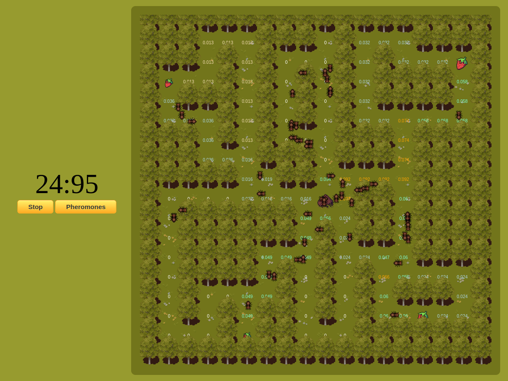
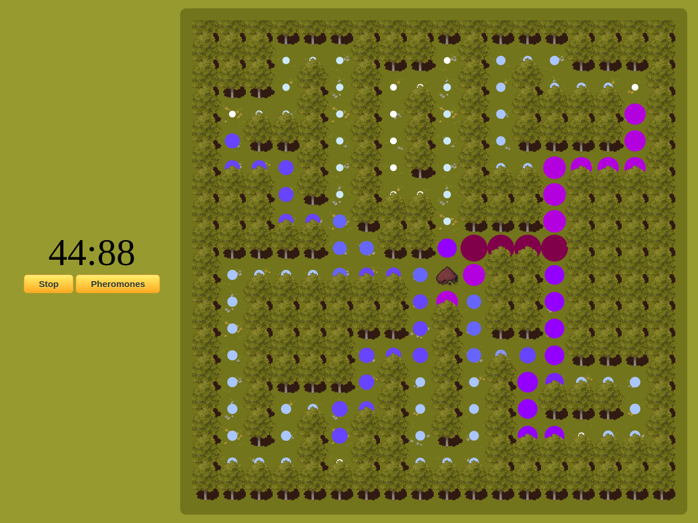
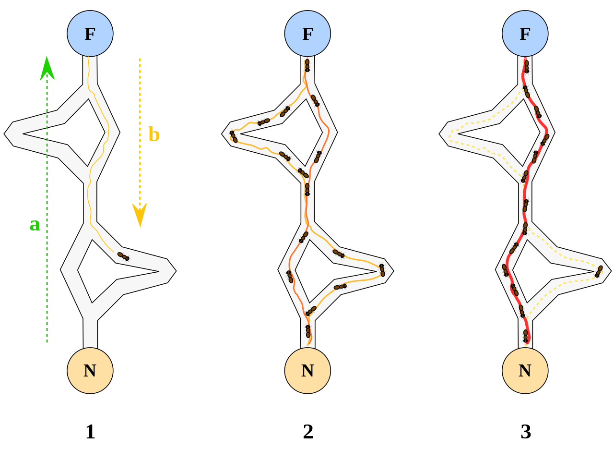

<h1> Projet de développement: Système multi-agents et recherche des plus courts chemins </h1>

<div style="text-align:center;margin-top:10px;margin-bottom:10px;">
    
    
</div>

<h2>Objectif et positionnement du projet</h2>

<div style="text-align:justify">
L’objectif de ce projet, orienté pratique et réalisé en groupe, est de vous inviter à penser, spécifier, concevoir et prototyper un système multi-agents capable de rechercher les chemins les plus courts pour atteindre un objectif donné. Cet exercice pédagogique doit être réalisé en utilisant spécifiquement les technologies suivantes: Javascript (<i>vanilla</i>), HTML et CSS et il doit être conçu selon une architecture MVC. Une équipe est constituée de 2 personnes qui seront mobilisées sur la réalisation d’un même projet.
</div>

<div style="text-align:justify">
Un système multi-agents (SMA) est un système informatique composé de multiples entités autonomes, appelées agents, qui interagissent entre elles pour atteindre des objectifs individuels ou collectifs. Chaque agent dans un SMA est capable de percevoir son environnement, de prendre des décisions autonomes et d'agir en conséquence pour influencer cet environnement.

Dans le cadre de ce projet, l'environnement est représenté par une grille où chaque cellule est caractérisée par sa nature. Il y a quatre types de cellules distincts :
  <ul>
    <li> point de départ des agents (cardinalité 1) </li>
    <li> obstacle, empêche le déplacement d'un agent (cardinalité 0 à n) </li>
    <li> objectif (cardinalité 1 à n) </li>
    <li> libre, capable de sauvegarder une valeur numérique (cardinalité 0 à n) </li>
  </ul>

  <div style="text-align:center;margin-top:10px;margin-bottom:10px;">
    
</div>

``` javascript
/* La classe mère */
class Cell {
    constructor(x, y) {
        this.x = x;
        this.y = y;
    }

    GetType() { return this.constructor.name; }
}

/* Les classes filles */
class Start extends Cell {
    constructor(x, y) {
        super(x, y);
    }
}

class Obstacle extends Cell {
    constructor(x, y) {
        super(x, y);
    }
}

class Objective extends Cell {
    constructor(x, y, qty = 1.0) {
        super(x, y);
        this._qty = qty;
    }

    GetQty() { return this._qty; }
    SetQty(newValue) { this._qty = newValue; }
}

class Free extends Cell {
    constructor(x, y, qty = 0.0) {
        super(x, y);
        this._qty = qty;
    }

    GetQty() { return this._qty;  }
    SetQty(newValue) { this._qty = newValue; }
}
```

Le but des agents est de ramener à leur point de départ tous les objectifs présents dans l'environnement. Ces objectifs sont caractérisés par un attribut représentant une quantité disponible. Étant donné que les agents ont une capacité de charge limitée et qu'ils conservent uniquement leur trajet depuis leur dernière visite au point de départ (se réinitialise à chaque passage), ils doivent élaborer une stratégie de mémorisation/communication pour signaler aux autres agents la possible existence d'un objectif. Cette communication se fait exclusivement par le biais d'une valeur numérique stockée dans les cellules libres. Par ailleurs, les agents ne perçoivent que les cellules qui sont adjacentes à eux (diagonales non comprises).
</div>

<div style="text-align:justify">
Ce projet est inspiré de l'algorithme de colonies de fourmis qui est une méthode d'optimisation elle-même inspirée par le comportement des fourmis réelles lorsqu'elles cherchent des chemins optimaux entre leur colonie et une source de nourriture. Cet algorithme simule le comportement des fourmis en utilisant des agents virtuels appelés "fourmis". Ces dernières se déplacent à travers un espace de solutions potentielles et lorsque l'une d'entre elles en trouve une, elle laisse derrière elle une trace chimique appelée "phéromone". Ces phéromones servent de communication indirecte entre les fourmis, indiquant la qualité des solutions trouvées. Ainsi, les fourmis explorent différentes solutions tout en favorisant les chemins contenant des phéromones plus fortes. Cela permet un équilibre entre l'exploration de nouvelles possibilités et l'exploitation des solutions connues. Les phéromones s'évaporent avec le temps, simulant le phénomène naturel où les traces chimiques laissées par les fourmis disparaissent progressivement.
</div>

<div style="text-align:center;margin-top:10px;margin-bottom:10px;">
    
    <p style="font-size:10px">https://fr.wikipedia.org/wiki/Algorithme_de_colonies_de_fourmis#/media/Fichier:Aco_branches.svg</p>
</div>


<h2> Les grandes étapes du projet </h2>

<div>
  <ul>
      <li> Constitution des équipes. </li>
      <li> S'approprier les bases du Javascript (et de la programmation orientée objet) à l'aide du cours en ligne (<a href="https://github.com/PAJEAN/cours_javascript/blob/master/javascript.ipynb">lien vers le cours</a> --> à ouvrir avec l'outil Jupyter-lab pour profiter de toutes les fonctionnalités - vous pouvez également le consulter directement sur la plateforme Github, par le biais de VSCode ou de l'outil <i>online mybinder.org</i>). </li>
      <li> S'approprier l'environnement &lt;canvas&gt; de HTML5 et Javascript. </li>
      <li> Modéliser et implémenter votre solution à travers une architecture <a href="../MVC/mvc.html">MVC</a> (Modèle, Vue, Contrôleur). Cette architecture permet de compartimenter le développement. Le modèle (M) gère la logique et les données du jeu. La vue (V) inclut la manière de représenter visuellement la grille du Tetris, les tetrominos (blocs) actuels et suivants, les animations et le score. Enfin, le contrôleur (C) connecte la vue et le modèle pour faire transiter les données de l'utilisateur vers le système afin de modifier les données actuelles. </li>
      <li> Comprendre et implémenter un algorithme de colonies de fourmis pour rechercher les chemins les plus courts. </li>
  </ul>
</div>

<h2> Cahier des charges du projet </h2>

<ul>
    <li> Utiliser tous les tetrominos. </li>
    <li> Pouvoir réaliser une rotation des tétrominos. </li>
    <li> Pouvoir faire chuter directement les tetrominos. </li>
    <li> Affichage d'un score. </li>
    <li> Accélérer la chute des tetrominos à mesure que le score augmente. </li>
    <li> Animation de chute des tetrominos. </li>
    <li> Animation lorsqu'une ligne est détruite. </li>
    <li> (Parcours Développement logiciel) Implémenter l'algorithme génétique pour optimiser les actions d'un <i>bot</i>. </li>
    <li> (Parcours Développement logiciel) Bouton pour activer/désactiver le <i>bot</i> en cours de partie. </li>
</ul>

<div style="text-align:justify">
<i>NB</i>: Afin d'exploiter l'ensemble des fonctionnalités de Javascript (notamment les modules), vous pouvez mettre en place un serveur local avec la technologie de votre choix (NodeJS, PHP, Python ou l'extension VSCode Live Server). Ce serveur local doit simplement servir une page HTML.
</div>

<h2> Évaluation </h2>

<div style="text-align:justify">
L'évaluation portera sur la qualité des rendus graphiques, de la rigueur du code source et de la restitution orale. Une note unique sera attribuée à l'ensemble des membres d'une équipe. <b>Des différenciations pourraient être appliquées si des disparités importantes d'investissement sont notées</b>.
</div>

<h3> Découpage des points</h3>
<ul>
    <li> Parcours Systèmes et Réseaux </li>
        <ul>
            <li> Respect du cahier des charges : 10 (découpage des points en fonction du cahier des charges: 1, 2, 1, 1, 2, 1, 2). </li>
            <li> Rigueur du code source (architecture MVC) : 6. </li>
            <li> Présentation orale : 4. </li>
        </ul>
    <li> Parcours Développement logiciel </li>
        <ul>
            <li> Respect du cahier des charges : 12 (découpage des points en fonction du cahier des charges: 0.5, 1, 0.5, 1, 1, 1, 1, 5, 1). </li>
            <li> Rigueur du code source (architecture MVC) : 4. </li>
            <li> Présentation orale : 4. </li>
        </ul>
</ul>

<h2> Rôle de l'encadrant </h2>

<ul>
    <li> Présenter et rappeler les exigences du	projet. </li>
    <li> Former	les équipes à la réalisation de tâches spécifiques nécessaires à la bonne tenue du projet. Cet accompagnement portera en particulier sur des aspects relatifs à de la programmation	(Javascript), au développement web (HTML, CSS) et à de l'algorithmie. </li>
</ul>

<h2> Soutenance orale et rendu </h2>

<div style="text-align:justify">
À la fin du projet <b>le 23/01/2023</b>, vous devez présenter vos travaux à l'oral (10 min de présentation et 5 min de question). Vous présenterez votre rendu, les choix techniques et algorithmiques et l'architecture de votre code. La présentation doit être accompagnée d'un support (<i>e.g.</i> diapo). Suite à cet oral, vous devez également envoyer votre code source par mail à l'encadrant sous la forme d'une archive compressée.
</div>

