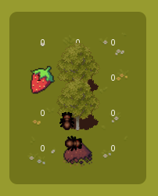
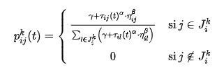
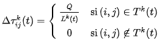

<h1> Projet de développement : Système multi-agents et recherche des plus courts chemins </h1>

<div align="center">
    
    
</div>

<h2>Objectif et positionnement du projet</h2>

<div style="text-align:justify">
L’objectif de ce projet, orienté pratique et réalisé en groupe, est de vous inviter à penser, spécifier, concevoir et prototyper un système multi-agents capable de rechercher les chemins les plus courts pour atteindre un objectif donné. Cet exercice pédagogique doit être réalisé en utilisant spécifiquement les technologies suivantes : Javascript (<i>vanilla</i>), HTML et CSS et il doit être conçu selon une <b>architecture MVC</b>. Une équipe est constituée de 2 personnes qui seront mobilisées sur la réalisation d’un même projet.
</div>

<div style="text-align:justify">
Un système multi-agents (SMA) est un système informatique composé de multiples entités autonomes, appelées agents, qui interagissent entre elles pour atteindre des objectifs individuels ou collectifs. Chaque agent dans un SMA est capable de percevoir son environnement, de prendre des décisions autonomes et d'agir en conséquence pour influencer cet environnement.

Dans le cadre de ce projet, l'environnement est représenté par une grille dans laquelle nous distinguons quatre types de cellules :
  <ul>
    <li> point de départ des agents (cardinalité 1) </li>
    <li> obstacle, empêche le déplacement d'un agent (cardinalité 0 à n) </li>
    <li> objectif (cardinalité 1 à n) </li>
    <li> libre, capable de sauvegarder une valeur numérique (cardinalité 0 à n) </li>
  </ul>

  <div align="center">
    
  </div>
</div>

<br>

Ces différents types de cellules peuvent être modélisées de la manière suivantes.

``` javascript
/* La classe mère */
class Cell {
    constructor(x, y) {
        this.x = x;
        this.y = y;
    }

    GetType() { return this.constructor.name; }
}

/* Les classes filles */
class Start extends Cell {
    constructor(x, y) {
        super(x, y);
    }
}

class Obstacle extends Cell {
    constructor(x, y) {
        super(x, y);
    }
}

class Objective extends Cell {
    constructor(x, y, qty = 1.0) {
        super(x, y);
        this._qty = qty;
    }

    GetQty() { return this._qty; }
    SetQty(newValue) { this._qty = newValue; }
}

class Free extends Cell {
    constructor(x, y, qty = 0.0) {
        super(x, y);
        this._qty = qty;
    }

    GetQty() { return this._qty;  }
    SetQty(newValue) { this._qty = newValue; }
}
```

<br>

<div style="text-align:justify">
Lors de la simulation, le but des agents est de ramener à leur point de départ tous les objectifs présents dans l'environnement. Ces objectifs sont caractérisés par un attribut représentant une quantité disponible. Étant donné que les agents ont une capacité de charge limitée et qu'ils conservent uniquement les cellules de leur trajet depuis leur dernière visite au point de départ (se réinitialise à chaque passage), ils doivent élaborer une stratégie de mémorisation/communication pour signaler aux autres agents la possible existence d'un objectif. Cette communication se fait exclusivement par le biais d'une valeur numérique stockée dans les cellules libres. Par ailleurs, les agents perçoivent uniquement les cellules adjacentes à leur emplacement actuel (diagonales non comprises).
</div>

<h2> Algorithme de colonies de fourmis </h2>

<div style="text-align:justify">
Ce projet est inspiré de l'algorithme de colonies de fourmis qui est une méthode d'optimisation elle-même inspirée par le comportement des fourmis réelles lorsqu'elles cherchent des chemins optimaux entre leur colonie et une source de nourriture. Cet algorithme simule le comportement des fourmis en utilisant des agents virtuels que nous pouvons appeler "fourmis". Ces dernières se déplacent à travers un espace de solutions potentielles et lorsque l'une d'entre elles en trouve une, elle laisse derrière elle une trace chimique appelée "phéromone". Ces phéromones servent de communication indirecte entre les fourmis, indiquant la qualité des solutions trouvées. Ainsi, les fourmis explorent différentes solutions tout en favorisant les chemins contenant davantage de phéromones. Cela permet un équilibre entre l'exploration de nouvelles possibilités et l'exploitation des solutions connues. Les phéromones s'évaporent avec le temps, simulant le phénomène naturel où les traces chimiques laissées par les fourmis disparaissent progressivement.
</div>

<br>

<div align="center">
    
    <h6>https://fr.wikipedia.org/wiki/Algorithme_de_colonies_de_fourmis#/media/Fichier:Aco_branches.svg</h6>
</div>

<div style="text-align:justify">
Dans le cadre de ce projet, nous pouvons résumer l'algorithme de colonies de fourmis par 3 équations. La première permet de calculer la probabilité associée aux différents déplacements possibles par une fourmi à une itération donnée t.

<br>

  <div align="center">
    
  </div>

<br>

où $J^k_i$ est la liste des déplacements possibles pour une fourmi $k$ lorsqu’elle se trouve à une position $i$ (dans notre cas, si elles existent, les cellules au-dessus, en dessous et sur les côtés de la position actuelle de la fourmi), $η_{ij}$ la visibilité, qui est égale à l’inverse de la distance de deux positions $i$ et $j$ ($1/d_{ij}$) et $τ_{ij}(t)$ l’intensité de la piste à une itération donnée $t$. Les deux principaux paramètres contrôlant l’algorithme sont α et β, qui contrôlent l’importance relative de l’intensité et de la visibilité d’une arête. Enfin, pour permettre aux fourmis de continuer à explorer des pistes non découvertes, on attribue une probabilité non nulle d'exploration des positions « inconnues », contrôlée par le paramètre γ.

<b><i>Nota Bene</i></b> : de par la contrainte liée au voisinage visible par une fourmi (1 case autour d'elle), le paramètre de visibilité n'est pas exploité (ou alors est égal à 1/1 pour toutes les cases). Nous pourrions l'utiliser si nous ajoutions un système de difficulté associée au déplacement par rapport à la nature des tuiles. Par exemple, une fourmi se déplace plus facilement sur la terre que dans l'herbe.

La seconde équation permet, une fois la fourmi retournée à son point de départ pour déposer la nourriture, de calculer la quantité de phéromone $\Delta \tau _{{ij}}^{k}$ à déposer sur l'ensemble des cellules qui compose le trajet emprunté par la fourmi entre la nourriture et son point de départ. Cette quantité vient s'additionner à la quantité déjà présente sur la cellule.

<br>

  <div align="center">
    
  </div>

<br>

où $T^k(t)$ est le trajet emprunté entre la nourriture et la colonie (son point de départ) par la fourmi $k$ à l’itération $t$, $L^k(t)$ la longueur du trajet et $Q$ un paramètre de réglage.

<b><i>Nota Bene</i></b> : la fourmi est capable de choisir le chemin le plus court à emprunter pour revenir à sa colonie en tenant compte uniquement des cellules qu'elle a exploré durant son trajet actuel. Une fois arrivée à la colonie, la mémorisation des cellules empruntées durant son dernier trajet est réinitialisée.

Enfin, la troisième équation permet à une fréquence donnée de simuler le phénomène d'évaporation des phéromones : $\textstyle \rho \tau _{ij}(t)$ avec $ρ$ un paramètre de réglage.

</div>

<h2> Les grandes étapes du projet </h2>

<div>
  <ul style="text-align:justify">
      <li> Constitution des équipes. </li>
      <li> S'approprier les bases du Javascript (et de la programmation orientée objet) à l'aide du cours en ligne (<a href="https://github.com/PAJEAN/cours_javascript/blob/master/javascript.ipynb">lien vers le cours</a> --> à ouvrir avec l'outil Jupyter-lab pour profiter de toutes les fonctionnalités - vous pouvez également le consulter directement sur la plateforme Github, par le biais de VSCode ou de l'outil <i>online mybinder.org</i>). </li>
      <li> S'approprier l'environnement <i>&lt;canvas&gt;</i> de HTML5 et Javascript. </li>
      <li> Modéliser et implémenter votre solution à travers <b>une architecture <a href="../MVC/mvc.html">MVC</a></b> (Modèle, Vue, Contrôleur). Cette architecture permet de compartimenter le développement. Le modèle (M) gère la logique et les données de la simulation. La vue (V) inclut la manière de représenter visuellement l'environnement, les fourmis, les phéromones et le temps écoulé. Enfin, le contrôleur (C) connecte la vue et le modèle pour faire transiter les données de l'utilisateur vers le système afin de modifier les données actuelles. </li>
      <li> Comprendre et implémenter un algorithme semblable à l'algorithme de colonies de fourmis pour rechercher les chemins les plus courts. </li>
  </ul>
</div>

<h2> Cahier des charges du projet </h2>

<ul style="text-align:justify">
    <li> Implémenter l'environnement, les différents types de cellules (en suivant les indications fournies) et les fourmis. Une source de nourriture a une quantité initiale de 1 et un agent est capable de transporter 0.1 unité lors d'un trajet. </li>
    <li> Implémenter les équations ci-dessus de l'algorithme de colonies de fourmis pour rendre le déplacement des fourmis optimisé. </li>
    <li> Les fourmis doivent revenir à leur point de départ (colonie) lorsqu'elles trouvent de la nourriture. Implémenter un algorithme de <i><a src="https://www.redblobgames.com/pathfinding/a-star/introduction.html">pathfinding</a></i> pour permettre aux fourmis de trouver le chemin le plus court pour revenir à la colonie. Ce <i>pathfinding</i> doit uniquement tenir compte des cellules visitées par la fourmi lors de son trajet pour trouver de la nourriture (la mémorisation de ce trajet est réinitialisée lorsqu'elle atteint la colonie). </li>
    <li> Représenter numériquement et graphiquement les traces de phéromones. </li>
    <li> La possibilité de mettre en pause la simulation. </li>
</ul>

<div style="text-align:justify">
<b><i>Nota Bene</i></b> : Afin d'exploiter l'ensemble des fonctionnalités de Javascript (notamment les modules), vous pouvez mettre en place un serveur local avec la technologie de votre choix (NodeJS, PHP, Python ou l'extension VSCode Live Server). Ce serveur local doit simplement servir une page HTML.
</div>

<h2> Évaluation </h2>

<div style="text-align:justify">
L'évaluation portera sur la qualité des rendus graphiques, de la rigueur du code source et de la restitution orale. Une note unique sera attribuée à l'ensemble des membres d'une équipe. <b>Des différenciations pourraient être appliquées si des disparités importantes d'investissement sont notées</b>.
</div>

<h3> Découpage des points </h3>
<ul>
    <li> Respect du cahier des charges : 12 (découpage des points en fonction du cahier des charges: 1, 3, 3, 4, 1 - peut être mené à évoluer). </li>
    <li> Rigueur du code source (architecture MVC) : 4. </li>
    <li> Présentation orale : 4. </li>
</ul>

<h2> Rôle de l'encadrant </h2>

<ul>
    <li> Présenter et rappeler les exigences du	projet. </li>
    <li> Former	les équipes à la réalisation de tâches spécifiques nécessaires à la bonne tenue du projet. Cet accompagnement portera en particulier sur des aspects relatifs à de la programmation	(Javascript), au développement web (HTML, CSS) et à de l'algorithmie. </li>
</ul>

<h2> Soutenance orale et rendu </h2>

<div style="text-align:justify">
À la fin du projet <b>le 02/02/2024</b>, vous devez présenter vos travaux à l'oral (10 min de présentation et 5 min de question). Vous présenterez votre rendu, les choix techniques et algorithmiques et l'architecture de votre code. La présentation doit être accompagnée d'un support (diapo). Suite à cet oral, vous devez également envoyer votre code source par mail à l'encadrant sous la forme d'une archive compressée.
</div>

