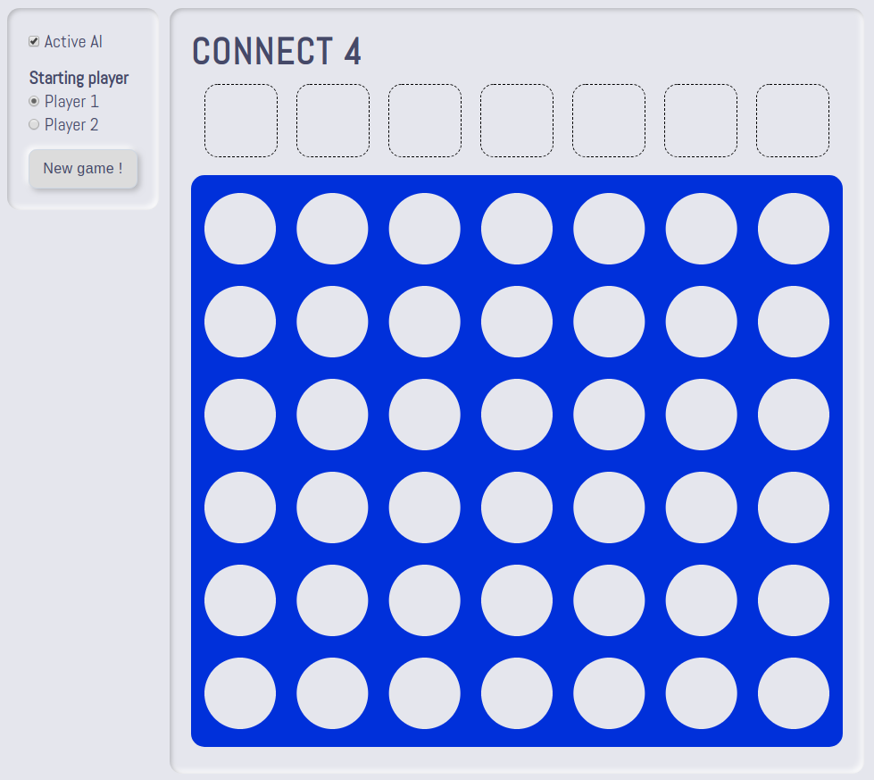

<h1> Projet de développement: création d'un bot pour jouer au Puissance 4 </h1>

<div style="text-align:center;margin-top:10px;margin-bottom:10px;">
    
</div>

<h2>Objectif et positionnement du projet</h2>

<div style="text-align:justify">
L’objectif de ce projet	orienté	pratique et réalisé	en groupe est de vous inviter à	penser, spécifier, concevoir et prototyper une <i>intelligence artificielle</i> pour jouer au Puissance 4. Cet exercice pédagogique doit être réalisé en utilisant spécifiquement les technologies suivantes: Javascript, HTML et CSS.

Une	équipe est constituée de 2 personnes qui seront mobilisées sur la réalisation d’un même projet.
</div>

<h2> Les grandes étapes du projet </h2>

<div style="text-align:justify">

<ul>
    <li> Constitution des équipes. </li>
    <li> S'approprier les bases du Javascript à partir du cours en ligne (https://github.com/PAJEAN/cours_javascript/blob/master/javascript.ipynb que vous pouvez ouvrir au sein d'un navigateur, par le biais de l'outil Jupyter ou de VSCode). </li>
    <li> S'approprier l'environnement &lt;canvas&gt; de HTML5 et Javascript. </li>
    <li> S'appropier l'algorithme du <i>minimax alpha bêta</i>. </li>
    <li> Modélisation et implémentation de votre solution au travers d'un modèle MVC. </li>
</ul>

</div>

<h2> Algorithmie, Technologies et Structuration du code </h2>

<h3> Technologies </h3>

Ce projet doit être développé en Javascript, HTML et CSS (HTML5 fournit à Javascript un environnement de dessin à partir de la balise &lt;canvas&gt;). Afin d'exploiter l'ensemble des fonctionnalités de Javascript (notamment les modules), vous pouvez mettre en place un serveur local avec la technologie de votre choix (NodeJS, PHP, Python ou l'extension VSCode Live Server). Ce serveur local doit simplement servir une page HTML.

<h3> Modèle MVC </h3>

Un modèle MVC est une manière d'organiser votre code.

* Le modèle (*Model*) gère les données et le contenu algorithmique de votre application.
* La vue (*View*) est la représentation visuelle du modèle.
* Le controleur (*Controller*) réalise le lien entre l'utilisateur (la vue) et le système (le modèle).


Au sein de cet exercice, le modèle représente la grille du Puissance 4 et le bot, à savoir. La vue, quant à elle, contient la manière de représenter visuellement la grille du Puissance 4, les jetons et les conditions de victoire et de défaite et un panneau de contrôle. Enfin, le controleur connecte la vue et le modèle pour faire transiter les données de l'utilisateur vers le système afin de modifier les données actuelles.

```
class Model {
  constructor() {}
}

class View {
  constructor() {}
}

class Controller {
  constructor(model, view) {
    this.model = model
    this.view = view
  }
}

const app = new Controller(new Model(), new View())
```

<h2> Cahier des charges du projet </h2>

Vous êtes développeur freelance et un client vous contacte pour développer son projet de bot intelligent pour jouer au Puissance 4. Ce client impose certaines caractéristiques au projet:

<ul>
    <li> Implémenter l'algorithme du minimax (ou un autre algorithme après discussion avec l'encadrant). </li>
    <li> Possibilité de jouer contre un adversaire humain. </li>
    <li> Possibilité de laisser l'IA commencer une partie. </li>
    <li> Partie graphique: voir le jeton tomber et rebondir </li>
</ul>

<h2> Évaluation </h2>

<div style="text-align:justify">
L'évaluation portera sur la qualité des rendus graphiques, de la rigueur du code source et de la restitution orale. Une note unique sera attribuée à l'ensemble des membres d'une équipe. Des différenciations pourraient être appliquées si des disparités importantes d'investissement sont notées.
</div>

<ul>
    <li> Respect du cahier des charges : 12 (découpage des points en fonction du cahier des charges: 5, 2, 2, 3). </li>
    <li> Rigueur du code source (architecture MVC) : 4. </li>
    <li> Présentation orale : 4. </li>
</ul>

<h2> Rôle de l'encadrant </h2>

<ul>
    <li> Présenter et rappeler les exigences du	projet. </li>
    <li> Former	les équipes à la réalisation de tâches spécifiques nécessaires à la bonne tenue du projet. Cet accompagnement portera en particulier sur des aspects relatifs à de la programmation	(Javascript), au développement web (HTML, CSS) et à de l'algorithmie. </li>
</ul>

<h2> Soutenance orale et rendu </h2>

<div style="text-align:justify">
À la fin du projet <b>le 27/01/2022</b>, vous devez présenter vos travaux à l'oral (10 min de présentation et 5 min de question). Vous présentez votre rendu, les choix techniques et algorithmiques et l'architecture de votre code. La présentation doit être accompagnée d'un support (<i>e.g.</i> diapo). Suite à cet oral, vous devez également envoyer votre code source par mail à l'encadrant sous la forme d'une archive compressée.
</div>

