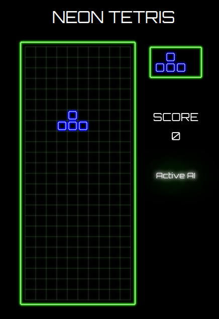
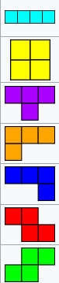

<h1> Projet de développement: Tetris </h1>

    

<h2>Objectif et positionnement du projet</h2>

L’objectif de ce projet, orienté pratique et réalisé en groupe, est de vous inviter à penser, spécifier, concevoir et prototyper un Tetris à travers une architecture MVC. Cet exercice pédagogique doit être réalisé en utilisant spécifiquement les technologies suivantes: Javascript (<i>vanilla</i>), HTML et CSS. Une équipe est constituée de 2 personnes qui seront mobilisées sur la réalisation d’un même projet.

<i>Nota Bene</i>: Un <b>objectif complémentaire</b> est exigé pour les étudiants du <b>parcours Développement logiciel</b>. Il porte sur le développement d'un <i>bot</i> (intelligence artificielle) pour jouer automatiquement au Tetris.

<h2> Les grandes étapes du projet </h2>

  <ul>
      <li> Constitution des équipes. </li>
      <li> S'approprier les bases du Javascript (et de la programmation orientée objet) à l'aide du cours en ligne (<a href="https://github.com/PAJEAN/cours_javascript/blob/master/javascript.ipynb">lien vers le cours</a> --> à ouvrir avec l'outil Jupyter-lab pour profiter de toutes les fonctionnalités - vous pouvez également le consulter directement sur la plateforme Github, par le biais de VSCode ou de l'outil <i>online mybinder.org</i>). </li>
      <li> S'approprier l'environnement &lt;canvas&gt; de HTML5 et Javascript. </li>
      <li> Modéliser et implémenter votre solution à travers une architecture <a href="../MVC/mvc.html">MVC</a> (Modèle, Vue, Contrôleur). Cette architecture permet de compartimenter le développement. Le modèle (M) gère la logique et les données du jeu. La vue (V) inclut la manière de représenter visuellement la grille du Tetris, les tetrominos (blocs) actuels et suivants, les animations et le score. Enfin, le contrôleur (C) connecte la vue et le modèle pour faire transiter les données de l'utilisateur vers le système afin de modifier les données actuelles. </li>
      <li> Pour le parcours Développement logiciel: Comprendre et implémenter un algorithme génétique pour optimiser les actions automatiques d'un <i>bot</i> (<a href="Algorithme_génétique.pdf">PDF</a>). </li>
  </ul>

<h2> Cahier des charges du projet </h2>

<ul>
    <li> Utiliser tous les tetrominos. </li>
    <li> Pouvoir réaliser une rotation des tétrominos. </li>
    <li> Pouvoir faire chuter directement les tetrominos. </li>
    <li> Affichage d'un score. </li>
    <li> Accélérer la chute des tetrominos à mesure que le score augmente. </li>
    <li> Animation de chute des tetrominos. </li>
    <li> Animation lorsqu'une ligne est détruite. </li>
    <li> (Parcours Développement logiciel) Implémenter l'algorithme génétique pour optimiser les actions d'un <i>bot</i>. </li>
    <li> (Parcours Développement logiciel) Bouton pour activer/désactiver le <i>bot</i> en cours de partie. </li>
</ul>

    
    
 Tétrominos existants 

<i>NB</i>: Afin d'exploiter l'ensemble des fonctionnalités de Javascript (notamment les modules), vous pouvez mettre en place un serveur local avec la technologie de votre choix (NodeJS, PHP, Python ou l'extension VSCode Live Server). Ce serveur local doit simplement servir une page HTML.

<h2> Évaluation </h2>

L'évaluation portera sur la qualité des rendus graphiques, de la rigueur du code source et de la restitution orale. Une note unique sera attribuée à l'ensemble des membres d'une équipe. <b>Des différenciations pourraient être appliquées si des disparités importantes d'investissement sont notées</b>.

<h3> Découpage des points</h3>
<ul>
    <li> Parcours Systèmes et Réseaux </li>
        <ul>
            <li> Respect du cahier des charges : 10 (découpage des points en fonction du cahier des charges: 1, 2, 1, 1, 2, 1, 2). </li>
            <li> Rigueur du code source (architecture MVC) : 6. </li>
            <li> Présentation orale : 4. </li>
        </ul>
    <li> Parcours Développement logiciel </li>
        <ul>
            <li> Respect du cahier des charges : 12 (découpage des points en fonction du cahier des charges: 0.5, 1, 0.5, 1, 1, 1, 1, 5, 1). </li>
            <li> Rigueur du code source (architecture MVC) : 4. </li>
            <li> Présentation orale : 4. </li>
        </ul>
</ul>

<h2> Rôle de l'encadrant </h2>

<ul>
    <li> Présenter et rappeler les exigences du	projet. </li>
    <li> Former	les équipes à la réalisation de tâches spécifiques nécessaires à la bonne tenue du projet. Cet accompagnement portera en particulier sur des aspects relatifs à de la programmation	(Javascript), au développement web (HTML, CSS) et à de l'algorithmie. </li>
</ul>

<h2> Soutenance orale et rendu </h2>

À la fin du projet <b>le 23/01/2023</b>, vous devez présenter vos travaux à l'oral (10 min de présentation et 5 min de question). Vous présenterez votre rendu, les choix techniques et algorithmiques et l'architecture de votre code. La présentation doit être accompagnée d'un support (<i>e.g.</i> diapo). Suite à cet oral, vous devez également envoyer votre code source par mail à l'encadrant sous la forme d'une archive compressée.

