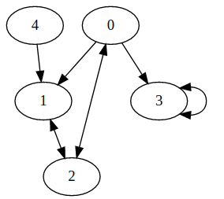

# Algorithme de parcours en largeur (BFS - *Breadth-first search*)

L'algorithme de parcours en largeur permet le parcours d'un graphe ou d'un arbre de la manière suivante : on commence par explorer un nœud source, puis ses successeurs, puis les successeurs non explorés des successeurs, etc. L'algorithme de parcours en largeur permet de calculer les distances de tous les nœuds depuis un nœud source dans un graphe non pondéré (orienté ou non orienté). Ce dernier point constitue l'objectif de ce TP.
À partir de la représentation matricielle d'un graphe orienté, vous allez devoir déterminer la distance, c'est-à-dire le nombre de noeuds (sommets), qui sépare un noeud source à tous les autres noeuds du graphe.


[Source](https://fr.wikipedia.org/wiki/Algorithme_de_parcours_en_largeur#/media/Fichier:Animated_BFS.gif)

# Représentation du graphe

Le graphe sera représenté par une matrice d'adjacence de taille n x n où n correspond au nombre de noeuds au sein du graphe. Au sein de cette matrice, les lignes correspondent aux noeuds sources et les colonnes aux noeuds cibles. La valeur 0 correspond à l'abscence d'une arête entre un noeud source et un noeud cible et la valeur 1 à la présence d'une arête dirigée entre le noeud source et le noeud cible.

Par exemple la matrice:

```
var matrix = [
    [0, 1, 1, 1, 0],
    [0, 0, 1, 0, 0],
    [1, 1, 0, 0, 0],
    [0, 0, 0, 1, 0],
    [0, 1, 0, 0, 0]
];
```

correspond au graphe suivant:



# Structure du code

Le code doit contenir une classe représentant le graphe et ayant deux méthodes, l'une permettant de calculer les distances entre les noeuds à partir d'une racine donnée et l'autre affichant le graphe à partir de la matrice d'adjacence.


BFS.js

```
class Graph{
    constructor(matrix){
        this.matrix = matrix;
    }

    distance(root){
    }

    display(){
        viz.renderSVGElement('digraph { a -> b [dir="both"] }')
        .then(function(element) {
            document.body.appendChild(element);
        })
        .catch(error => {
            // Create a new Viz instance (@see Caveats page for more info)
            viz = new Viz();

            // Possibly display the error
            console.error(error);
        });
    }
}
```

BFS.html

```
<!DOCTYPE html>
<html>
	<head>
		<meta charset="utf-8">
		<title>BFS</title>
	</head>
	<body>
		<script src="viz.js"></script>
		<script src="full.render.js"></script>
		<script src="BFS.js"></script>
	</body>
</html>
```

Les librairies graphiques nécessaires sont présents dans le dossier exemples/librairies.