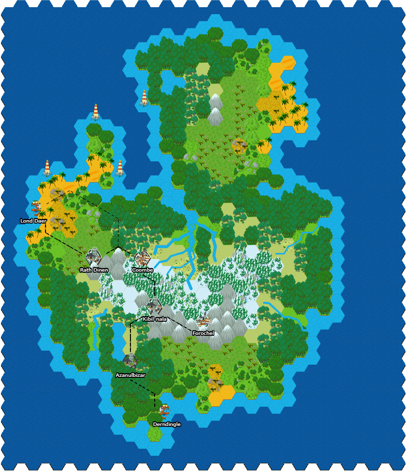
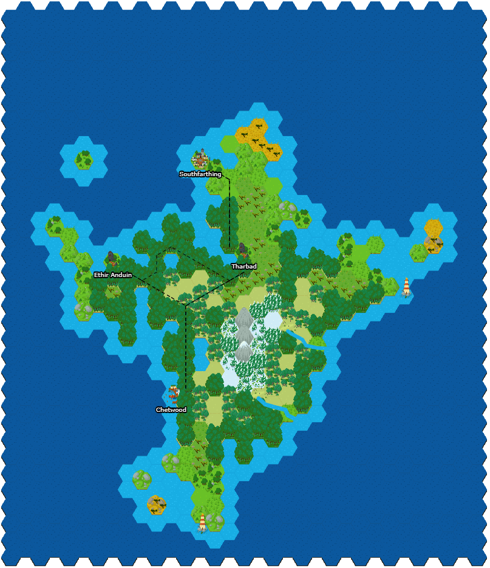
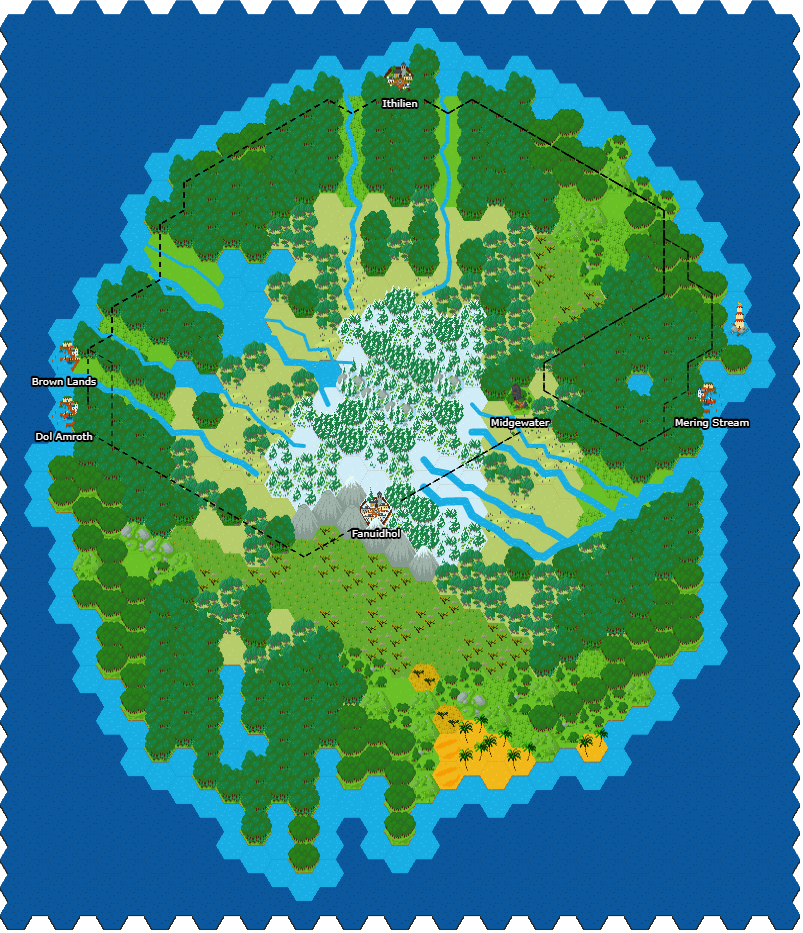
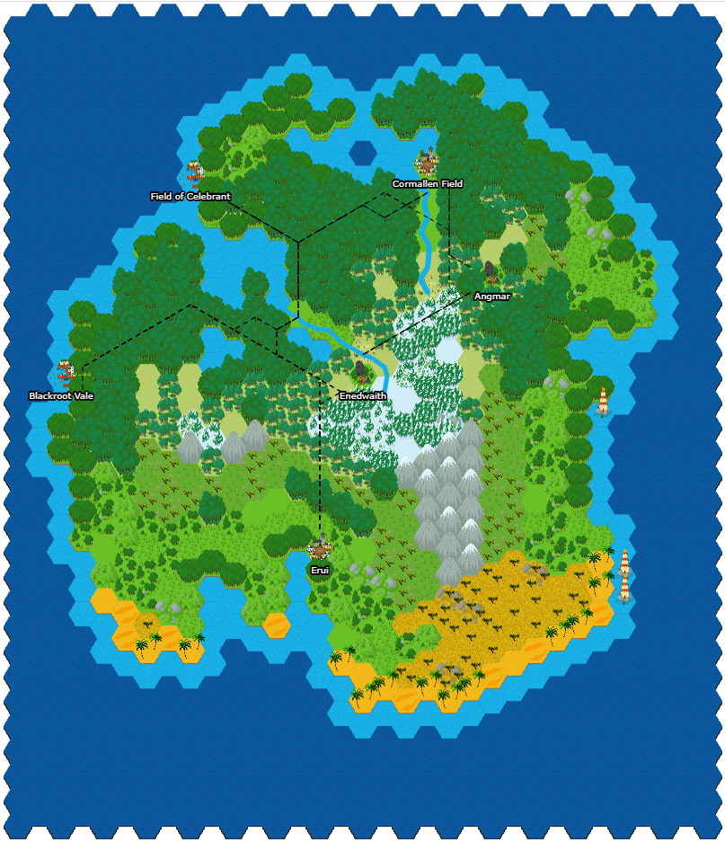
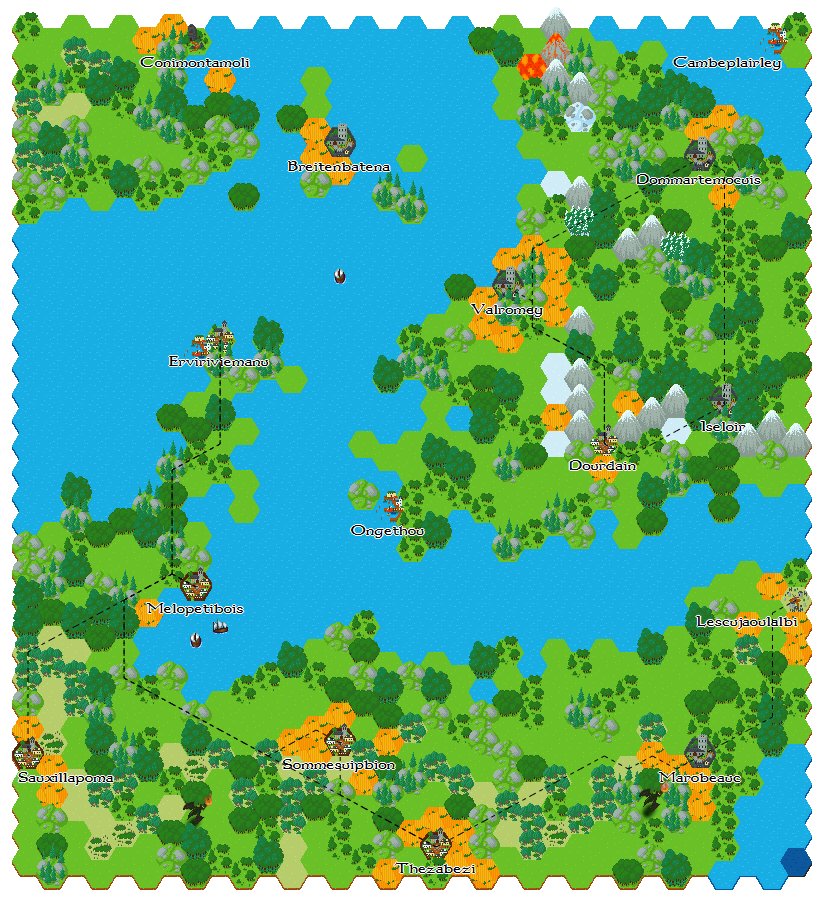
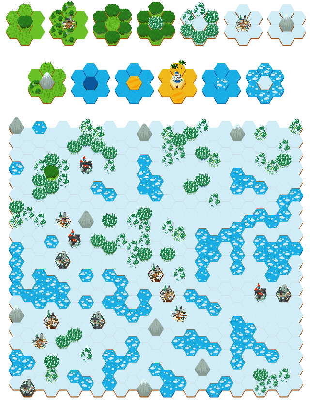
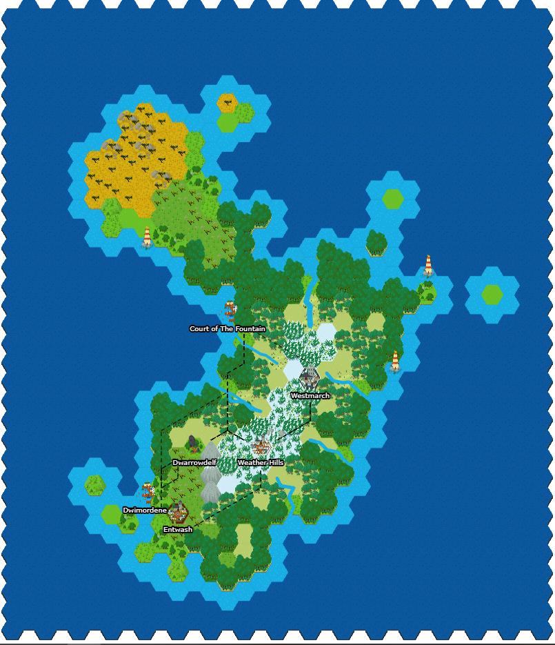
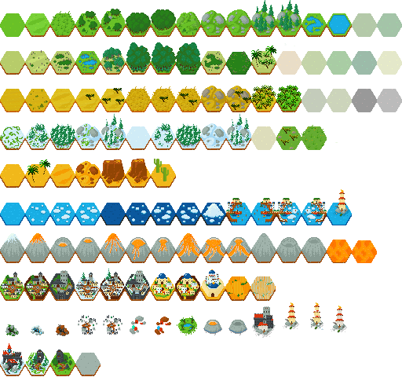

<h1> Projet de développement: Génération procédurale de cartes </h1>

<div style="text-align:center;margin-top:10px;margin-bottom:10px;">
    
    
    
    
</div>

<h2>Objectif et positionnement du projet</h2>

<div style="text-align:justify">
L’objectif de ce projet	orienté	pratique et réalisé	en groupe est de vous inviter à	penser, spécifier, concevoir et prototyper un système informatisé de génération procédurale de cartes à partir d'un ensemble de tuiles hexagonales.	Cet	 exercice pédagogique doit être réalisé en utilisant spécifiquement les technologies suivantes: Javascript, HTML et CSS.

Une	équipe est constituée de 3 personnes qui seront mobilisées sur la réalisation d’un même projet (selon le nombre de personnes au sein d'une classe, nous adapterons ce nombre).
</div>

<h2> Les grandes étapes du projet </h2>

<div style="text-align:justify">

<ul>
    <li> Constitution des équipes. </li>
    <li> S'approprier les bases du Javascript à partir du cours en ligne (https://github.com/PAJEAN/cours_javascript/blob/master/javascript.ipynb que vous pouvez ouvrir au sein d'un navigateur ou par le biais de l'outil Jupyter). </li>
    <li> S'approprier l'environnement &lt;canvas&gt; de HTML5 et Javascript. </li>
    <li> Recherche algorithmique de votre générateur. </li>
    <li> Modélisation et implémentation de votre solution. </li>
</ul>

</div>

<h2> Algorithmie et Technologies </h2>

La génération de carte est un sujet relativement bien documenté et exploré. Il existe plusieurs façons algorithmiques de l'aborder:
<ul> 
    <li> Fonctions de bruit </li>
    <ul>
        <li> Bruit de Perlin (https://www.redblobgames.com/maps/terrain-from-noise/) </li>
        <li> Diamond square (https://en.wikipedia.org/wiki/Diamond-square_algorithm) </li>
        <div style="text-align:center; margin: 20px">
            
        </div>
    </ul>
    <li> Satisfaction de contraintes </li>
    <ul>
        <li> Wave Function Collapse (https://github.com/mxgmn/WaveFunctionCollapse) </li>
        <div style="text-align:center; margin: 20px">
            
        </div>
    </ul>
    <li> Modèles hybrides </li>
    <ul>
        <li> Génération procédurale d'un ensemble de caractéristiques (élévation, humidité, etc.) afin de générer de manière déterministe le biome et par conséquent les tuiles à afficher (http://www-cs-students.stanford.edu/~amitp/game-programming/polygon-map-generation/). </li>
        <div style="text-align:center; margin: 20px">
            
        </div>
    </ul>
</ul>

<div style="text-align:justify">
Ce projet a la contrainte de devoir exploiter des tuiles hexagonales. Vous trouverez toutes les subtilités algorithmiques (et du code Javascript) sur le site https://www.redblobgames.com/grids/hexagons/ et https://www.redblobgames.com/grids/hexagons/codegen/output/lib-module.js !
</div>

<div style="text-align:center">
    
</div>

<div style="text-align:justify; margin-bottom:10px">
Le fichier de tuiles provient de https://cuddlyclover.itch.io/fantasy-hex-tiles ! Une telle image peut être utilisée directement au sein de votre projet à l'aide de la fonction suivante (https://developer.mozilla.org/fr/docs/Web/API/CanvasRenderingContext2D/drawImage):
</div>

```
void ctx.drawImage(image, sx, sy, sLargeur, sHauteur, dx, dy, dLargeur, dHauteur);
```

<div style="text-align:justify; margin-bottom:10px">
Si vous ne voyez aucune image s'afficher en exploitant cette fonction, c'est normal, il faut attendre qu'elle se charge. Pour cela, vous pouvez par exemple exploiter une <i>Promise</i>.
</div>

```
const HEXTILES_IMAGE = new Image();
HEXTILES_IMAGE.src = 'images/hextiles.png';
Promise.all([
    new Promise( (resolve) => {HEXTILES_IMAGE.addEventListener('load', () => { resolve();}); })
])
.then(() => {
    /* 
        Votre code.
    }*/
});
```

Ce projet doit être développé en Javascript, HTML et CSS (HTML5 fournit à Javascript un environnement de dessin à partir de la balise &lt;canvas&gt;). Afin d'exploiter l'ensemble des fonctionnalités de Javascript (notamment les modules), vous pouvez mettre en place un serveur local avec la technologie de votre choix (NodeJS, PHP, Python). Ce serveur local doit simplement servir une page HTML.

<h2> Cahier des charges du projet </h2>

Vous êtes développeur freelance et un client vous contacte pour développer son projet de génération de cartes. Ce client impose certaines caractéristiques au projet:

<ul>
    <li> Utiliser le lot de tuiles pré-définies (vous avez la possibilité d'ajouter de nouvelles tuiles). </li>
    <li> Conserver une cohérence globale de la carte (éviter une génération purement aléatoire à l'aide d'un algorithme de génération procédurale pertinent). </li>
    <li> Nommer les villes. </li>
    <li> Générer des rivières. </li>
    <li> Générer des routes cohérentes. </li>
</ul>

<h2> Évaluation </h2>

<div style="text-align:justify">
L'évaluation portera sur la qualité des rendus graphiques, de la rigueur du code source et de la restitution orale. Une note unique sera attribuée à l'ensemble des membres d'une équipe. Des différenciations pourraient être appliquées si des disparités importantes d'investissement sont notées.
</div>

<ul>
    <li> Respect du cahier des charges : 12 (découpage des points en fonction du cahier des charges: 1, 7, 1, 1, 2). </li>
    <li> Rigueur du code source (paradigme, architecture, etc.) : 4. </li>
    <li> Présentation orale : 4. </li>
</ul>

<h2> Rôle de l'encadrant </h2>

<ul>
    <li> Présenter et rappeler les exigences du	projet. </li>
    <li> Former	les équipes à la réalisation de tâches spécifiques nécessaires à la bonne tenue du projet. Cet accompagnement portera en particulier sur des aspects relatifs à de la programmation	(Javascript), au développement web (HTML, CSS) et à de l'algorithmie. </li>
</ul>

<h2> Soutenance orale et rendu </h2>

<div style="text-align:justify">
À la fin du projet <b>le 22/01/2021</b>, vous devez présenter vos travaux à l'oral (10 min de présentation et 5 min de question). Vous présentez votre rendu, les choix techniques et algorithmiques et l'architecture de votre code. La présentation doit être accompagnée d'un support (<i>e.g.</i> diapo). Suite à cet oral, vous devez également envoyer votre code source par mail à l'encadrant sous la forme d'une archive compressée.
</div>

