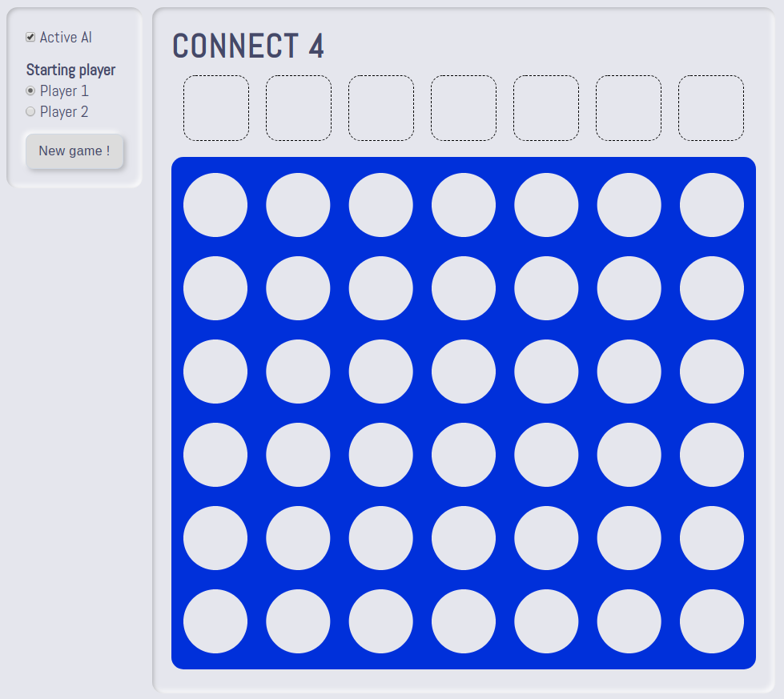

<h1> Projet de développement: création d'un <i>bot</i> pour jouer au Puissance 4 </h1>

    

<h2>Objectif et positionnement du projet</h2>

L’objectif de ce projet,	orienté	pratique et réalisé	en groupe, est de vous inviter à	penser, spécifier, concevoir et prototyper un <i>bot</i> (intelligence artificielle) pour jouer au Puissance 4. Cet exercice pédagogique doit être réalisé en utilisant spécifiquement les technologies suivantes: Javascript, HTML et CSS. Une	équipe est constituée de 2 personnes qui seront mobilisées sur la réalisation d’un même projet.

<h2> Les grandes étapes du projet </h2>

  <ul>
      <li> Constitution des équipes. </li>
      <li> S'approprier les bases du Javascript (et de la programmation orientée objet) à l'aide du cours en ligne (<a href="https://github.com/PAJEAN/cours_javascript/blob/master/javascript.ipynb">lien vers le cours</a> --> à ouvrir avec l'outil Jupyter-lab pour profiter de toutes les fonctionnalités - vous pouvez également le consulter directement sur la plateforme Github ou par le biais de VSCode). </li>
      <li> S'approprier l'environnement &lt;canvas&gt; de HTML5 et Javascript. </li>
      <li> Comprendre l'algorithme du <i>minimax alpha bêta</i> (<a href="../Ressources/Minimax.pdf">PDF</a> sur l'algorithme du <i>minimax</i>). </li>
      <li> Modélisation et implémentation de votre solution au travers d'un modèle <a href="../MVC/mvc.html">MVC</a>. Au sein de cet exercice, le modèle gère la logique du jeu Puissance 4 et le comportement du <i>bot</i>. La vue, quant à elle, contient la manière de représenter visuellement la grille du Puissance 4, les jetons, les animations, l'affichage de la victoire et les événements déclenchés à partir du panneau de contrôle. Enfin, le controleur connecte la vue et le modèle pour faire transiter les données de l'utilisateur vers le système afin de modifier les données actuelles. </li>
  </ul>

<h2> Cahier des charges du projet </h2>

Vous êtes développeur freelance et un client vous contacte pour développer son projet de <i>bot</i> intelligent pour jouer au Puissance 4. Ce client impose certaines caractéristiques au projet:

<ul>
    <li> Implémenter l'algorithme du minimax. </li>
    <li> Possibilité de jouer contre un adversaire humain. </li>
    <li> Possibilité de laisser l'IA commencer une partie. </li>
    <li> Avoir un panneau de contrôle pour gérer ces différents aspects: activer ou non l'IA, laisser un joueur donné débuter la partie.
    <li> Un écran (modal) pour afficher la victoire d'un joueur. </li>
    <li> Voir le jeton tomber et rebondir. </li>
</ul>

<i>NB</i>: Afin d'exploiter l'ensemble des fonctionnalités de Javascript (notamment les modules), vous pouvez mettre en place un serveur local avec la technologie de votre choix (NodeJS, PHP, Python ou l'extension VSCode Live Server). Ce serveur local doit simplement servir une page HTML.

<h2> Évaluation </h2>

L'évaluation portera sur la qualité des rendus graphiques, de la rigueur du code source et de la restitution orale. Une note unique sera attribuée à l'ensemble des membres d'une équipe. Des différenciations pourraient être appliquées si des disparités importantes d'investissement sont notées.

<ul>
    <li> Respect du cahier des charges : 12 (découpage des points en fonction du cahier des charges: 4, 2, 2, 2, 1, 1). </li>
    <li> Rigueur du code source (architecture MVC) : 4. </li>
    <li> Présentation orale : 4. </li>
</ul>

<h2> Rôle de l'encadrant </h2>

<ul>
    <li> Présenter et rappeler les exigences du	projet. </li>
    <li> Former	les équipes à la réalisation de tâches spécifiques nécessaires à la bonne tenue du projet. Cet accompagnement portera en particulier sur des aspects relatifs à de la programmation	(Javascript), au développement web (HTML, CSS) et à de l'algorithmie. </li>
</ul>

<h2> Soutenance orale et rendu </h2>

À la fin du projet <b>le 27/01/2022</b>, vous devez présenter vos travaux à l'oral (10 min de présentation et 5 min de question). Vous présenterez votre rendu, les choix techniques et algorithmiques et l'architecture de votre code. La présentation doit être accompagnée d'un support (<i>e.g.</i> diapo). Suite à cet oral, vous devez également envoyer votre code source par mail à l'encadrant sous la forme d'une archive compressée.

