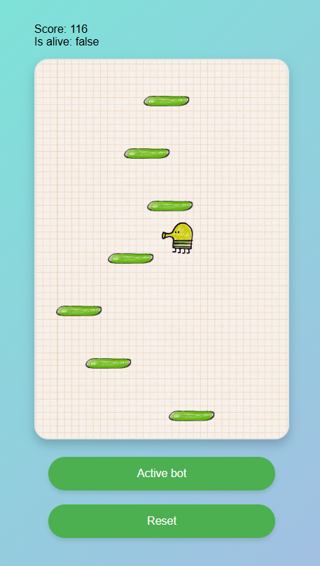
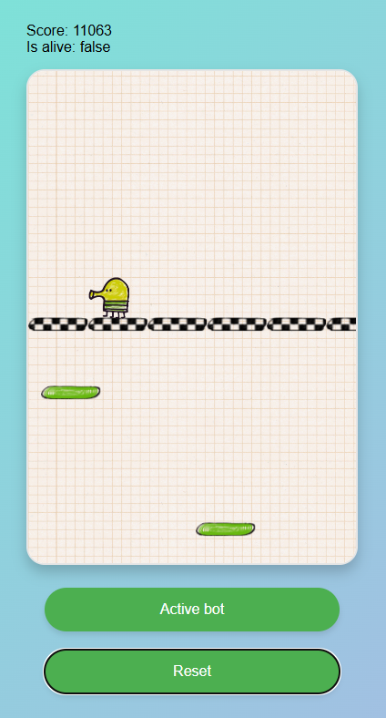
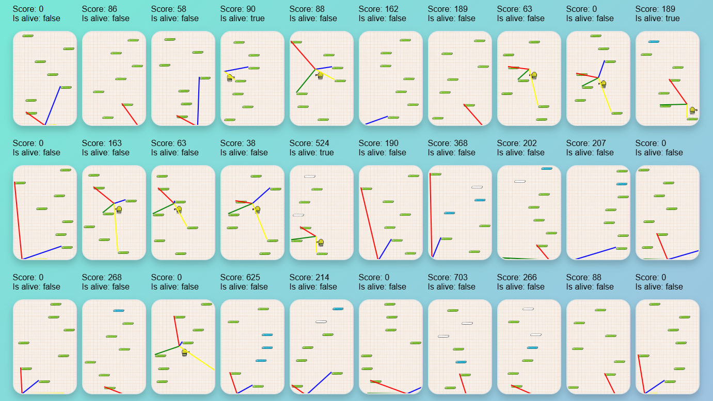

<h1> Projet de développement : Version simplifiée de Doodle Jump (et mise en place d'un bot) </h1>

    
    

<h2>Objectif et positionnement du projet</h2>

L'objectif de ce projet, orienté pratique et réalisé en groupe, est de vous inviter à penser, modéliser et prototyper une version simplifiée du jeu Doodle Jump. Cet exercice pédagogique doit être réalisé en utilisant spécifiquement les technologies suivantes : Javascript (<i>vanilla</i>), HTML et CSS et il doit être conçu selon une <b>architecture MVC</b> préise. Une équipe est constituée de 2 personnes qui seront mobilisées sur la réalisation d'un même projet.

<b><i>Nota Bene</i></b> : Afin d'exploiter l'ensemble des fonctionnalités de Javascript (notamment les modules), vous pouvez mettre en place un serveur local avec la technologie de votre choix (NodeJS, PHP, Python ou l'extension VSCode Live Server). Ce serveur local doit simplement servir une page HTML.

<h2>Spécifications attendues</h2>

Voici les spécifications attendues de la simplification du jeu Doodle Jump:

1. **Le saut du personnage**: Le personnage, souvent appelé "*Doodle the Doodler*", saute automatiquement de manière continue. Le rôle du joueur est de guider ses mouvements latéraux (à gauche ou à droite) en utilisant les commandes directionnelles. Le but est de toujours atterrir sur une plateforme pour continuer à monter. Si Doodle tombe hors de l'écran en bas, la partie est terminée.
2. **Déplacement d'écran à écran**: Lorsque Doodle se déplace vers un rebord de l'écran et en sort complètement d'un côté, il réapparaît automatiquement de l'autre côté. Par exemple, si Doodle quitte l'écran par le bord droit, il réapparaît instantanément au bord gauche, tout en gardant la même trajectoire.
3. **Les types de plateformes**:
    * Normales: Ce sont les plateformes les plus fréquentes. Lorsque Doodle atterrit dessus, il rebondit et continue son ascension. Elles restent fixes et sont faciles à utiliser.
    * Mouvantes: Ces plateformes se déplacent horizontalement de manière répétée.
    * Disparaissantes: Ces plateformes disparaissent dès que Doodle les touche. Elles ne permettent qu'un seul rebond, après quoi elles se désintègrent. Il faut planifier votre trajectoire avec soin pour ne pas dépendre uniquement de ces plateformes.
4. **Progression de la difficulté**: Au fur et à mesure que vous progressez dans le jeu, la difficulté augmente graduellement, le rendant de plus en plus exigeant. Au début, les plateformes normales sont nombreuses et rapprochées, facilitant les rebonds de Doodle. Cependant, plus vous montez, plus les plateformes deviennent rares. De plus, la fréquence des plateformes spéciales (plateformes mouvantes ou disparaissantes) augmente, introduisant des défis supplémentaires.
5. **Intelligence artificielle** (parcours DL): Conception d'un bot capable de jouer de manière autonome au jeu Doodle Jump. Chaque groupe est libre de définir sa propre stratégie pour coder ou entraîner ce bot, mais celle-ci devra être validée par l'enseignant avant sa mise en œuvre. Pour les groupes n'ayant pas de stratégie spécifique en tête, une approche par défaut est proposée : utiliser un réseau de neurones pour contrôler le bot, avec une optimisation via un algorithme génétique. Cette méthode combine la capacité des réseaux de neurones à apprendre des comportements complexes avec la flexibilité des algorithmes génétiques pour ajuster les paramètres de manière évolutive.

  

<h2> Intelligence artificielle </h2>

L'entraînement d'un réseau de neurones se compose de deux phases principales : la phase de *feedforward*, qui consiste à calculer une sortie en fonction des données d'entrée en faisant passer ces dernières à travers le réseau, et la phase de *backpropagation*, qui ajuste les poids du réseau en fonction de l'écart entre les sorties calculées et les résultats attendus, afin d'améliorer les performances du modèle. Cependant, dans notre cas, nous n'avons pas de résultats attendus pour superviser l'apprentissage. Par conséquent, nous utilisons un algorithme génétique pour remplacer la phase de *backpropagation* et permettre ainsi l'optimisation des poids du réseau.

<h3>Réseau de neurones: <i>feedforward</i></h3>

La phase de *feedforward* est l'étape d'un réseau de neurones, où les données entrent dans le réseau et sont transformées pour produire une sortie (<a href="../Ressources/ReseauNeurones.pdf">PDF</a>).

1. **Entrée**: Les données sont fournies au réseau sous forme d'un vecteur de nombres.
Ces nombres représentent les neurones d'entrée. 

2. **Calcul dans les couches cachées**: Les neurones d'entrée envoient les informations aux neurones des couches cachées. Chaque neurone effectue un calcul :
    * Il combine les entrées avec des poids (des valeurs qui modifient l'importance de chaque entrée).
    * Il ajoute un biais (une valeur pour ajuster le calcul).
    * Il applique une fonction d'activation (comme ReLU ou Sigmoïde).
Ces calculs sont répétés couche par couche jusqu'à la couche finale.

3. **Sortie**: La dernière couche produit une prédiction ou un résultat. Dans le cas de Doodle Jump, il prédit si Doodle doit se déplacer à gauche, à droite ou ne rien faire.

<h3>Algorithme génétique (simuler la <i>backpropagation</i>)</h3>

L'utilisation d'un algorithme génétique (<a href="../Ressources/AlgorithmeGenetique.pdf">PDF</a>) pour l'entraînement d'un réseau de neurones est une approche alternative à l'optimisation classique par *backpropagation*. Elle est une solution possible dans les cas où il n'existe pas de données supervisées ou de sorties attendues précises pour guider l'apprentissage. Dans cette méthode, les poids du réseau (et éventuellement les biais) sont considérés comme les gènes d'un individu, et une population d'individus (réseaux) est générée. L'algorithme suit alors un processus inspiré de l'évolution naturelle : les réseaux sont évalués en fonction d'une fonction de fitness qui mesure leur performance sur une tâche donnée (le score du jeu). Les meilleurs individus sont sélectionnés pour créer une nouvelle génération, en appliquant des opérations de croisement (combinaison des poids de deux réseaux) et de mutation (modification aléatoire des poids). Ce processus se répète sur plusieurs générations, permettant au réseau d'évoluer vers des performances optimales. Bien que moins efficace que la backpropagation dans des contextes supervisés, cette approche est flexible et bien adaptée à des environnements où l'évaluation des performances ne repose que sur des résultats globaux ou simulés.

<h2> Les grandes étapes du projet </h2>

  <ul style="text-align:justify">
      <li> Constitution des équipes. </li>
      <li> S'approprier les bases du Javascript (et de la programmation orientée objet) à l'aide du cours en ligne (<a href="https://github.com/PAJEAN/cours_javascript/blob/master/javascript.ipynb">lien vers le cours</a> --> à ouvrir avec l'outil Jupyter-lab pour profiter de toutes les fonctionnalités - vous pouvez également le consulter directement sur la plateforme Github, par le biais de VSCode ou de l'outil <i>online mybinder.org</i>). </li>
      <li> S'approprier l'environnement <i>&lt;canvas&gt;</i> de HTML5 et Javascript. </li>
      <li> Modéliser et implémenter votre solution à travers <b>une architecture <a href="../MVC/mvc.html">MVC</a></b> (Modèle, Vue, Contrôleur). Cette architecture permet de compartimenter le développement. Le modèle (M) gère la logique et les données de la simulation. La vue (V) inclut la manière de représenter visuellement l'environnement, les fourmis, les phéromones et le temps écoulé. Enfin, le contrôleur (C) connecte la vue et le modèle pour faire transiter les données de l'utilisateur vers le système afin de modifier les données actuelles. </li>
      <li> Comprendre et implémenter une simplification du jeu Doodle Jump. </li>
      <li> (Partie DL) Comprendre et implémenter un bot capable de jouer au jeu Doodle Jump. </li>
  </ul>

<h2> Évaluation </h2>

L'évaluation portera sur la qualité des rendus graphiques, de la rigueur du code source et de la restitution orale. Une note unique sera attribuée à l'ensemble des membres d'une équipe. <b>Des différenciations pourraient être appliquées si des disparités importantes d'investissement sont notées</b>. Le barême peut être mené à évoluer.

<h3>Parcours SR</h3>

<ul>
    <li> Respect des spécifications: 10 (découpage des points en fonction des spécifications: 2, 2, 3, 3). </li>
    <li> Rigueur du code source (architecture MVC) : 6. </li>
    <li> Présentation orale : 4. </li>
</ul>

<h3>Parcours DL</h3>

<ul>
    <li> Respect des spécifications: 12 (découpage des points en fonction des spécifications: 1, 1, 2, 2, 6). </li>
    <li> Rigueur du code source (architecture MVC) : 4. </li>
    <li> Présentation orale : 4. </li>
</ul>

<h2> Rôle de l'encadrant </h2>

<ul>
    <li> Présenter et rappeler les exigences du	projet. </li>
    <li> Former	les équipes à la réalisation de tâches spécifiques nécessaires à la bonne tenue du projet. Cet accompagnement portera en particulier sur des aspects relatifs à de la programmation	(Javascript), au développement web (HTML, CSS) et à de l'algorithmie. </li>
</ul>

<h2> Soutenance orale et rendu </h2>

À la fin du projet <b>le 06/02/2025</b>, vous devez présenter vos travaux à l'oral (10 min de présentation et 5 min de question). Vous présenterez votre rendu, les choix techniques et algorithmiques et l'architecture de votre code. La présentation doit être accompagnée d'un support (diapo). Suite à cet oral, vous devez également envoyer votre code source par mail à l'encadrant sous la forme d'une archive compressée.

