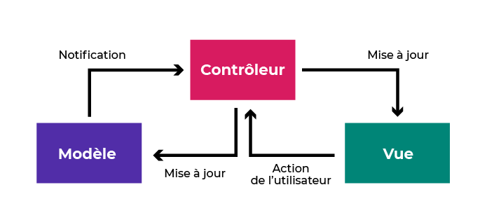

<h2> L'architecture MVC (Modèle-Vue-Controleur) </h2>

Un modèle MVC est une manière d'organiser votre code.

* Le modèle (*Model*) gère les données et le contenu algorithmique de votre application.
* La vue (*View*) est la représentation visuelle du modèle.
* Le controleur (*Controller*) réalise le lien entre l'utilisateur (la vue) et le système (le modèle).



```
class Model {
  constructor() {}
}

class View {
  constructor() {}
}

class Controller {
  constructor(model, view) {
    this.model = model
    this.view = view
  }
}

const app = new Controller(new Model(), new View())
```